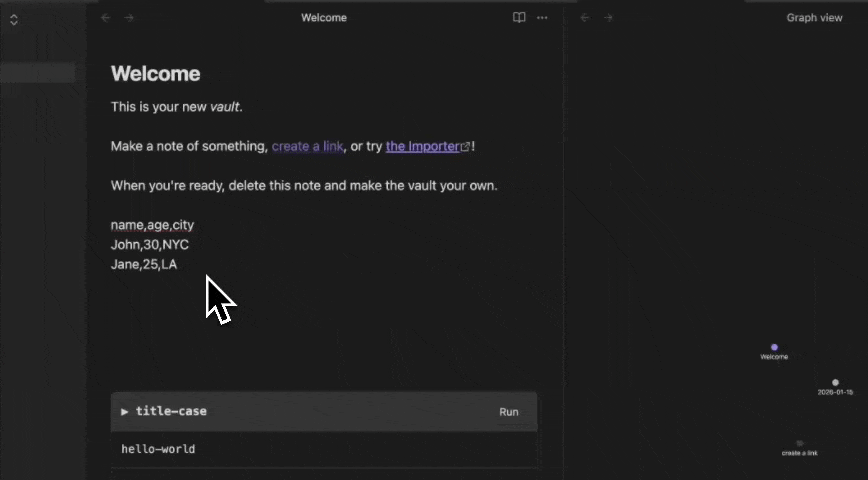

# Temper Plugin for Obsidian

Run code snippets from your notes using the [Temper CLI](https://tempercode.dev).



## Features

### Commands

| Command | Description |
|---------|-------------|
| **Run snippet on selection (replace)** | Select text, pick a snippet, replace selection with output |
| **Run snippet on selection (insert below)** | Select text, pick a snippet, insert output below |
| **Quick run by slug (replace)** | Type slug directly, runs on selection and replaces |
| **Quick run by slug (insert below)** | Type slug directly, runs on selection and inserts below |
| **Insert snippet code** | Pick a snippet, insert its code at cursor |
| **Edit snippet** | Pick a local snippet, open in editor |
| **Insert run block** | Insert a `temper-run` block template |
| **Insert embed block** | Insert a `temper-embed` block template |

### Code Blocks

#### `temper-run` - Execute a Snippet

Run a snippet with input from the block content:

````markdown
```temper-run
title-case
hello world from obsidian
```
````

With parameters:

````markdown
```temper-run
fibonacci
n: 10
```
````

With both parameters and stdin input:

````markdown
```temper-run
some-snippet
limit: 5
---
This is the input text
```
````

#### `temper-embed` - Display Snippet Code

Embed a snippet's source code in your note:

````markdown
```temper-embed
title-case
```
````

The rendered block shows the code with **Edit** and **↗** buttons:
- **Edit** - Opens the snippet file in your editor
- **↗** - Opens the snippet on tempercode.dev (for remote snippets)

## Installation

### Prerequisites

Install the Temper CLI:

```bash
npm install -g temper-cli
# or
bun install -g temper-cli
```

### From Source

1. Clone and build the plugin:

```bash
cd editors/obsidian
npm install
npm run build
```

2. Copy to your Obsidian vault:

```bash
mkdir -p ~/Obsidian/.obsidian/plugins/temper
cp main.js manifest.json styles.css ~/Obsidian/.obsidian/plugins/temper/
```

3. Enable the plugin in Obsidian:
   - Open Settings → Community plugins
   - Enable "Temper"

### Development

For development with hot reload:

```bash
npm run dev
```

Then symlink to your vault:

```bash
ln -s $(pwd) ~/Obsidian/.obsidian/plugins/temper
```

## Configuration

Open Settings → Temper to configure:

| Setting | Description | Default |
|---------|-------------|---------|
| CLI Path | Path to the `temper` executable | `temper` |
| Snippets Directory | Path to local snippets | `~/Snippets` |

## Usage Examples

### Quick Text Transform

1. Select some text in your note
2. Run command: **Temper: Quick run by slug (replace)**
3. Type `sort-lines` and press Enter
4. Selection is replaced with sorted lines

### Useful Snippets for Obsidian

| Slug | Description |
|------|-------------|
| `sort-lines` | Sort lines alphabetically |
| `dedupe-lines` | Remove duplicate lines |
| `sum-numbers` | Sum all numbers in text |
| `csv-to-markdown` | Convert CSV to markdown table |
| `json-to-yaml` | Convert JSON to YAML |
| `yaml-to-json` | Convert YAML to JSON |
| `title-case` | Convert text to Title Case |
| `url-parse` | Parse URL into components |

### Example: CSV to Markdown Table

Select CSV data:
```
name,age,city
John,30,NYC
Jane,25,LA
```

Run `csv-to-markdown` → get a formatted table:
```markdown
| name | age | city |
| --- | --- | --- |
| John | 30 | NYC |
| Jane | 25 | LA |
```

### Example: Sum Numbers in a List

Select text with numbers:
```
- Apples: 5
- Oranges: 3
- Bananas: 12
```

Run `sum-numbers` → `20`

### Pro Tip: Assign Hotkeys

For snippets you use often, assign a hotkey to **Quick run by slug** commands:

1. Open Settings → Hotkeys
2. Search for "Temper: Quick run"
3. Assign a hotkey (e.g., `Cmd+Shift+R` for replace)

Then you can quickly: select text → hotkey → type slug → Enter

### Reproducible Processing

Create a run block in your note:

````markdown
## API Response

```temper-run:json-format
{"name":"test","values":[1,2,3],"nested":{"key":"value"}}
```
````

Click **Run** to format the JSON. Edit the input and run again anytime.

### Document Your Snippets

````markdown
## My Utility Functions

### Title Case

Converts text to title case:

```temper-embed:title-case
```

Use it like this...
````

The code block shows the actual implementation and stays in sync with your snippet library.

## Troubleshooting

### "Failed to spawn temper"

The CLI is not found. Either:
- Install temper globally: `npm install -g temper-cli`
- Set the full path in Settings → Temper → CLI Path

### "No local snippets found"

The Edit command only works with local snippets in `~/Snippets`. Create one:

```bash
temper add my-snippet
```

## License

MIT
