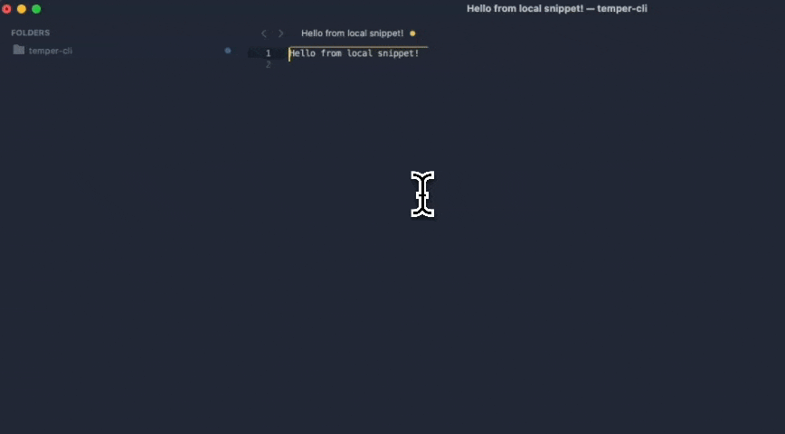

# Temper for Sublime Text

Insert and run code snippets from [tempercode.dev](https://tempercode.dev) directly in Sublime Text.



## Features

- **Insert Snippet**: Search for snippets filtered by your current file's syntax and insert the code
- **Run with Selection**: Execute snippets using your selected text as input
  - Replace selection with output
  - Insert output below selection
  - Show output in panel

## Requirements

You need to have temper CLI installed and available in your PATH.

```bash
curl -fsSL https://tempercode.dev/install.sh | bash

# https://github.com/handcraftbyte/temper-cli/releases
```

## Installation

### Package Control (Recommended)

Coming soon.

### Manual Installation

1. Open Sublime Text
2. Go to `Preferences > Browse Packages...`
3. Create a folder called `Temper`
4. Copy all files from this directory into the `Temper` folder

## Commands

| Command | Description |
|---------|-------------|
| `Temper: Insert Snippet` | Search and insert a code snippet |
| `Temper: Run Snippet (Replace Selection)` | Run snippet with selection, replace with output |
| `Temper: Run Snippet (Insert Below)` | Run snippet with selection, insert output below |
| `Temper: Run Snippet (Show Output)` | Run snippet with selection, show in output panel |

## Usage

### Insert a Snippet

1. Open the Command Palette (`Cmd+Shift+P` / `Ctrl+Shift+P`)
2. Type "Temper: Insert Snippet"
3. Enter a search query (e.g., "uuid", "slugify")
4. Select a snippet from the list
5. The code is inserted at your cursor

### Run a Snippet on Selected Text

1. Select some text in your editor
2. Open the Command Palette
3. Choose one of the "Temper: Run Snippet" commands
4. Enter a search query and select a snippet
5. The output replaces your selection, is inserted below, or shown in the output panel

## Settings

Settings can be modified in `Preferences > Package Settings > Temper > Settings`.

```json
{
    // Path to the temper CLI executable
    "cli_path": "temper"
}
```

## Examples

**Transform text to title case:**
1. Select: `hello world`
2. Run: `Temper: Run Snippet (Replace Selection)`
3. Search: `title-case`
4. Result: `Hello World`

**Generate a UUID:**
1. Run: `Temper: Insert Snippet`
2. Search: `uuid`
3. A UUID generation snippet is inserted

## Menu

Commands are also available under `Tools > Temper` in the menu bar.

## Links

- [tempercode.dev](https://tempercode.dev)
- [temper-cli on GitHub](https://github.com/handcraftbyte/temper-cli)
